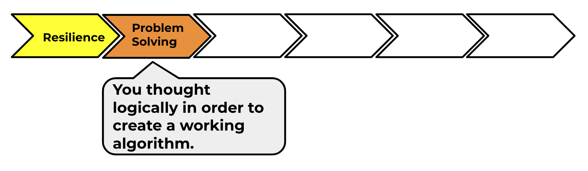

## What have you learned?

Try the Ghostbusters project next! In that project, you will learn how to create a game with ghosts that appear all over the place and that you need to catch. You will also learn how to add a timer and a score to the game, so that you can see how many ghosts you are able to catch.

You can find the link to Ghostbusters on the module pathway. Remember to complete the projects in the order they are listed.

--- no-print ---

  <iframe allowtransparency="true" width="485" height="402" src="https://scratch.mit.edu/projects/embed/276874679/?autostart=false" frameborder="0" scrolling="no"></iframe>
  

--- /no-print ---

--- print-only ---

--- /print-only ---

Click on the 'Click me' button to try the next project:

<a href="https://codeclub.org/en/scratch1">

